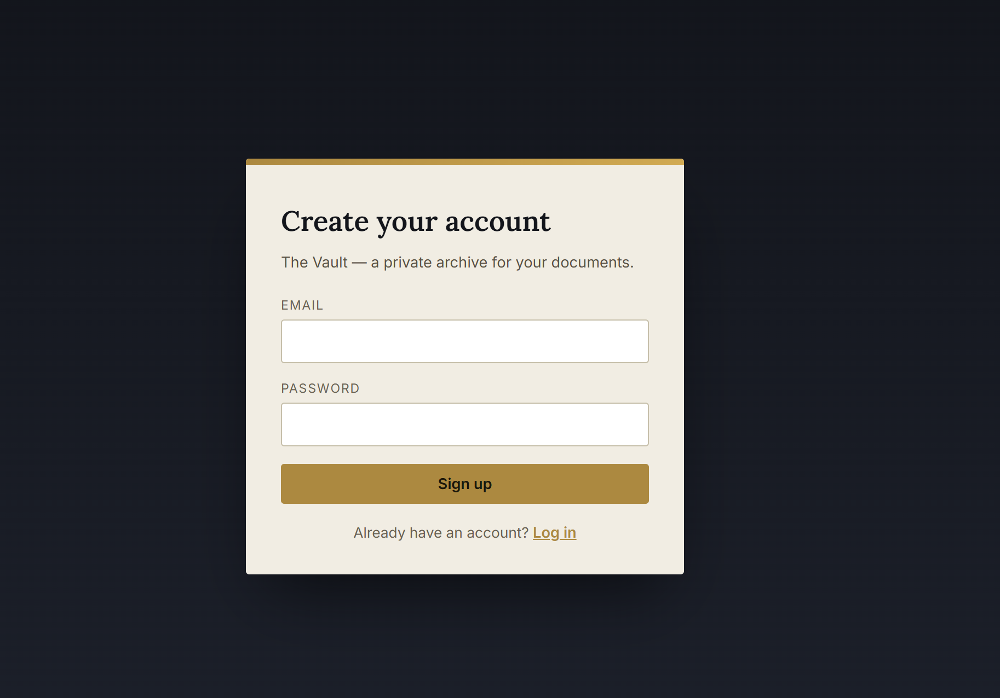
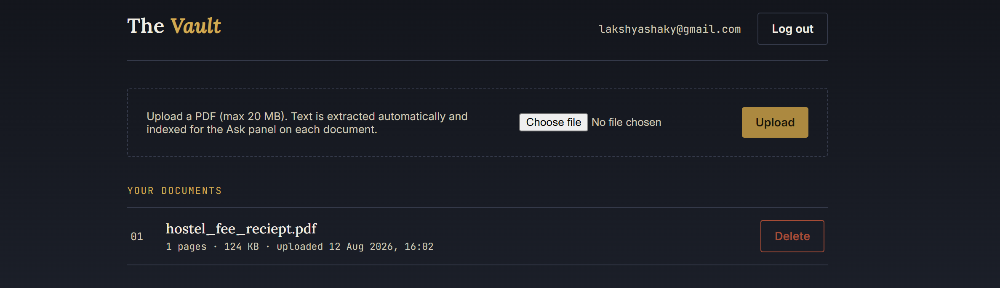
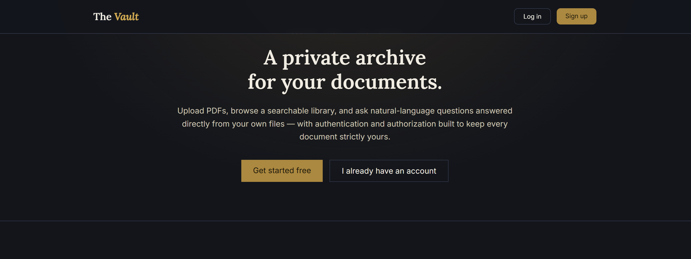
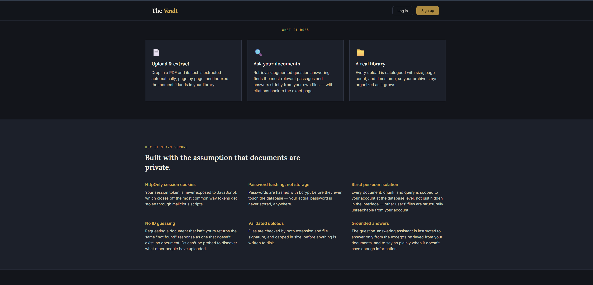
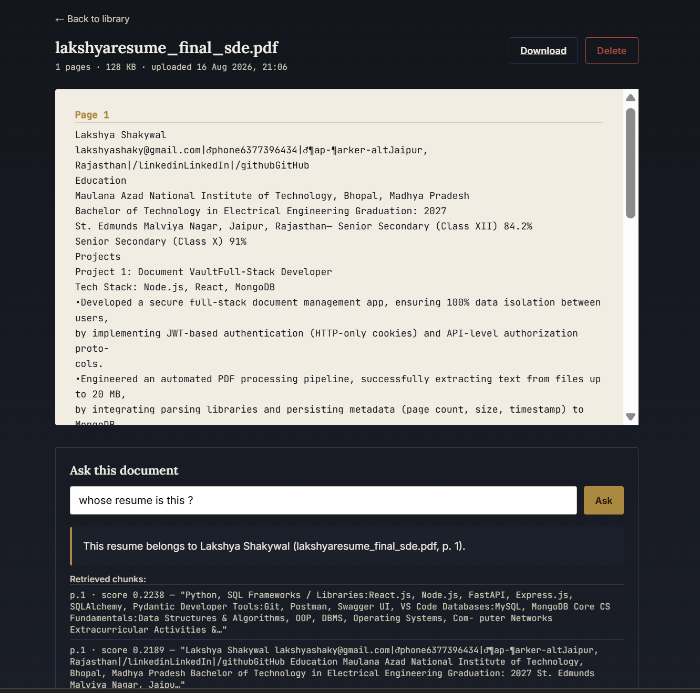

# The Vault — Document Vault + RAG

A full-stack app for uploading PDFs, extracting their text, browsing your own
library, and asking natural-language questions answered via Retrieval-Augmented
Generation (RAG) over your documents — with a landing page, card-based library,
and multi-provider LLM support so it runs entirely on free API tiers if you want.

## Screenshots

<p>
  
  
  
  
  
  
</p>

---

## Table of contents

- [Features](#features)
- [Stack](#stack)
- [Project layout](#project-layout)
- [Getting started](#getting-started)
- [Choosing an LLM provider](#choosing-an-llm-provider)
- [Design decisions](#design-decisions)
  - [Why JWT-in-cookie instead of server-side sessions](#why-jwt-in-cookie-instead-of-server-side-sessions)
  - [Authorization model](#authorization-model)
  - [RAG pipeline](#rag-pipeline)
- [Known limitations / next steps](#known-limitations--next-steps)

---

## Features

- **Landing page** — a public marketing page at `/` explaining what the app
  does and how it keeps documents private, with sign in / sign up in the nav.
- **Accounts** — signup/login/logout with bcrypt-hashed passwords and a
  JWT session stored in an HttpOnly cookie.
- **Upload & extract** — drag-and-drop or click-to-upload PDFs (max 20 MB);
  text is extracted per page automatically and indexed on upload.
- **Card-based library** — uploaded documents are shown in a responsive card
  grid with a "card catalog" stamp badge, hover-lift, and skeleton loading
  states while data fetches.
- **Ask this document (RAG)** — natural-language Q&A answered strictly from
  your own document excerpts, with page citations, backed by a locally-run
  embedding model (no API key required for retrieval).
- **Toast notifications** — non-blocking success/error feedback for uploads,
  deletes, and RAG errors, instead of static banners.
- **Polished interactions** — hover-zoom on buttons and cards, rounded nav
  buttons, and loading spinners throughout.
- **Multi-provider LLM support** — works with Anthropic, Google Gemini, or
  Groq for answer generation; pick whichever you have a key for (see
  [Choosing an LLM provider](#choosing-an-llm-provider)).

## Stack

- **Backend**: Python, Flask, SQLAlchemy, SQLite
- **Auth**: bcrypt password hashing + JWT in an HttpOnly cookie
- **PDF parsing**: `pypdf`
- **RAG retrieval**: `sentence-transformers` (local embeddings, no API key
  needed) + a from-scratch numpy cosine-similarity search
- **RAG generation**: Anthropic, Google Gemini, or Groq — whichever API key
  is configured (see below)
- **Frontend**: plain HTML/CSS/JS (no build step), served by Flask so cookies
  work same-origin without extra CORS complexity

## Project layout

```
document-vault/
├── backend/
│   ├── app.py               # Flask app factory, registers blueprints, serves frontend
│   ├── config.py            # all settings, loaded from .env
│   ├── extensions.py        # db = SQLAlchemy()
│   ├── models.py            # User, Document, Chunk
│   ├── auth.py               # /api/auth/signup|login|logout|me
│   ├── documents.py          # /api/documents  (upload/list/get/download/delete)
│   ├── rag.py                # /api/rag/ask    (RAG question answering, multi-provider)
│   ├── utils/
│   │   ├── security.py      # bcrypt + JWT + @login_required decorator
│   │   ├── pdf_utils.py      # per-page text extraction + chunking
│   │   └── embeddings.py     # sentence-transformers + cosine similarity search
│   ├── requirements.txt
│   ├── .env.example
│   └── uploads/               # per-user PDF storage (created at runtime)
├── frontend/
│   ├── landing.html           # public marketing page, served at "/"
│   ├── index.html              # login / signup (also reachable at ?mode=signup)
│   ├── library.html            # document library (card grid) + upload
│   ├── document.html           # extracted text + "ask this document" panel
│   └── static/
│       ├── css/
│       │   ├── style.css        # shared app styles (cards, toasts, buttons, forms)
│       │   └── landing.css      # landing-page-specific styles
│       └── js/
│           ├── toast.js          # shared toast notification system
│           ├── auth.js
│           ├── library.js
│           └── document.js
└── docs/
    └── screenshots/
```

## Getting started

```bash
cd backend
python -m venv venv
source venv/bin/activate        # Windows: venv\Scripts\activate
pip install -r requirements.txt

cp .env.example .env
# edit .env — see "Choosing an LLM provider" below for the RAG-related keys

python app.py
```

Then open **http://localhost:5000** — you'll land on the marketing page; sign
up, upload a PDF, and try asking it a question from the document detail page.

> **Note:** the first upload will download the `all-MiniLM-L6-v2` embedding
> model (~90 MB) from Hugging Face — this only happens once and is cached
> locally afterward. This step doesn't need any API key; it's separate from
> the LLM providers below.

## Choosing an LLM provider

Retrieval (finding the relevant chunks of your documents) always runs locally
and is free. Only the final answer-generation step calls an external LLM API,
and `rag.py` supports three interchangeable providers. Set **one** of these
in `backend/.env` — whichever is filled in first, in this order, is used:

| Priority | Provider | Cost | Get a key |
|---|---|---|---|
| 1 | **Anthropic** (`ANTHROPIC_API_KEY`) | Paid, highest quality | [console.anthropic.com](https://console.anthropic.com/) |
| 2 | **Groq** (`GROQ_API_KEY`) | Free, no card required | [console.groq.com/keys](https://console.groq.com/keys) |
| 3 | **Gemini** (`GEMINI_API_KEY`) | Free tier, no card required | [aistudio.google.com/apikey](https://aistudio.google.com/apikey) |

Leave the other two blank — only the first one found is used. If none are
set, the "Ask this document" panel returns a clear message telling you to
configure one, instead of failing silently.

> **Windows note:** if you use Groq and see `Client.__init__() got an
> unexpected keyword argument 'proxies'`, pin `httpx<0.28` in
> `requirements.txt` and reinstall — this is a known compatibility issue
> between the `groq` package and newer `httpx` releases, not a bug in this app.

## Design decisions

### Why JWT-in-cookie instead of server-side sessions

- **Stateless**: no server-side session store to manage or scale (no Redis,
  no sticky sessions if you run multiple Flask workers/containers).
- **HttpOnly + SameSite=Lax**: the token is never readable by JavaScript
  (mitigates token theft via XSS) and isn't sent on cross-site form
  submissions (mitigates CSRF).
- **Short expiry (24h)**: limits the blast radius if a cookie is ever
  intercepted; trivial to shorten further or add refresh tokens later.
- Trade-off acknowledged: revoking a single JWT before it expires needs a
  denylist (not implemented here) — a server-side session table would make
  instant revocation easier at the cost of needing shared state across
  instances. For this project's scale, JWT is the simpler, sufficient choice.

### Authorization model

- **Upload validation**: rejects non-PDF files by extension *and* by
  magic-byte sniffing (`%PDF-` header), and rejects files over 20 MB — both
  client-side (fast feedback) and server-side (source of truth).
- **Per-user scoping everywhere**: `/api/documents` only ever queries
  `filter_by(user_id=current_user.id)`; delete removes both the DB row and
  the file on disk.
- **No ID enumeration**: every document/chunk read, download, and delete goes
  through `_get_owned_document_or_404()`, which filters by `user_id` *in the
  same query* that fetches the row — a document belonging to another user
  returns an identical 404 (not a 403), so IDs can't be probed to discover
  what other users have uploaded.
- **No stale-session views after logout**: HTML pages are served with
  `Cache-Control: no-store`, and `library.js`/`document.js` force a reload on
  `pageshow` if restored from the browser's back/forward cache — otherwise
  hitting "back" after logout could show a stale, still-logged-in page.

### RAG pipeline

1. **Ingest** — on upload, extracted page text is split into ~800-character
   overlapping chunks (`pdf_utils.chunk_text`), each chunk is embedded with a
   local `all-MiniLM-L6-v2` sentence-transformer model, and the vector is
   stored alongside the chunk in the `chunks` table (scoped to `user_id` +
   `document_id`).
2. **Retrieve** — when a user asks a question (`POST /api/rag/ask`), the
   question is embedded the same way, and cosine similarity is computed
   against only that user's chunks (optionally scoped to one document),
   returning the top 5 matches. This is a from-scratch numpy implementation
   so the project has no external vector-DB dependency; swap
   `utils/embeddings.cosine_search` for FAISS/pgvector/Pinecone if you need
   to scale past a few thousand chunks per user.
3. **Generate** — the retrieved chunks (each tagged with filename + page) are
   passed as context to whichever LLM provider is configured, with a system
   prompt that forces the model to answer only from the supplied excerpts
   and cite `(filename, page)` for every claim. The response is returned to
   the frontend along with the raw retrieved chunks, so users can verify the
   answer against the source text.

Because retrieval is filtered by `user_id` at the database query level (not
just in application logic after the fact), one user's question can never
surface another user's document content — RAG respects the same
authorization boundary as the rest of the app.

## Known limitations / next steps

- No email verification or password reset flow.
- No JWT revocation/denylist — see trade-off note above.
- Embeddings/cosine search are in-process and O(n) per user; fine for a
  personal document vault, would need a real vector index at large scale.
- No rate limiting on `/api/rag/ask` — each call costs an API request against
  whichever provider is configured, so a free-tier key (Groq/Gemini) could
  hit daily limits under heavy use.
- No full-text keyword search across documents, only semantic RAG search.
- No folders/tags for organizing a large library.
# Document-Vault

